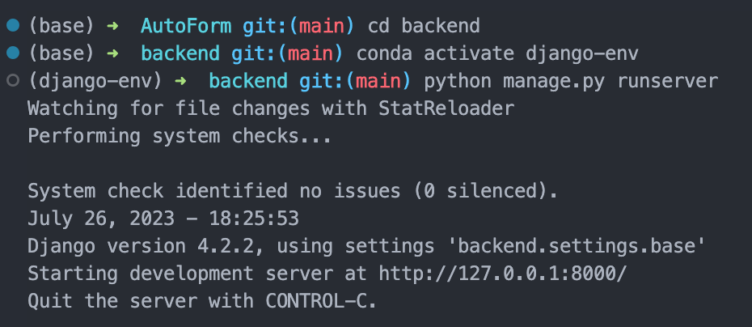
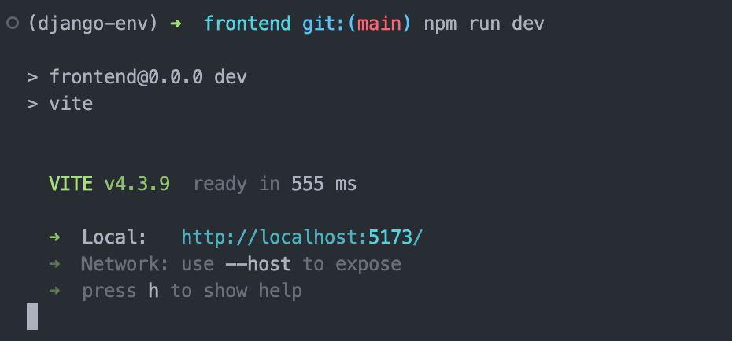

# Getting Started

## Prerequisites

To set up the development environment for the Augmented Quote Management System, you need to have the following:

- Python 3.11
- Node.js
- MariaDB

To manage the environment, the following are recommended:

- nvm
- conda

## Clone the Codebase

To get a copy of the project, clone the repository from GitHub. You can do this by running the following command in your terminal:

```shell
git clone git@github.com:maochengxu/AutoForm.git
```

## Setting Up the Environment

1. Navigate to the root path of the project:
    ```shell
    cd <path-to-the-project>
    ```
2. Install the required Python packages. The necessary packages are listed in the `environment.yml` and `requirements.txt` files located in the root path of the project. Run the following commands to install these packages:
    ```shell
    conda env create -f environment.yml
    pip install -r requirements.txt
    ```
3. Install mysqlclient python package and weasyprint.
    > mysqlclient: <https://github.com/PyMySQL/mysqlclient#install>

    > weasyprint: <https://doc.courtbouillon.org/weasyprint/stable/first_steps.html#installation>

4. Create database
    ```sql
    CREATE DATABASE betterform;
    CREATE USER 'xxxxx'@'localhost' IDENTIFIED BY 'xxxxx';
    GRANT ALL PRIVILEGES ON betterform.* TO 'xxxxx'@'localhost';
    FLUSH PRIVILEGES;
    EXIT;
    ```
    Then the settings in the backend/backend/settings/base.py should be changed.

5. Create admin user for Django

    > See: <https://docs.djangoproject.com/en/4.2/intro/tutorial02/#creating-an-admin-user>

6. Install the frontend packages

    ```shell
    cd frontend
    npm install
    ```

## Starting the Backend

With the environment set up, you can now start the backend server. Navigate to the `backend` directory and activate the `django-env` conda environment:
```shell
cd backend
conda activate django-env
```
Run the following commands to apply migrations and start the server:
```shell
python manage.py migrate
python manage.py runserver
```
Now you will see the backend running in <http://127.0.0.1:8000/>




## Starting the Frontend

With all the necessary packages installed, you can run the dev server of vue:
```shell
cd frontend
npm run dev
```
Now you will see the vue dev server running in <http://localhost:5173/>

