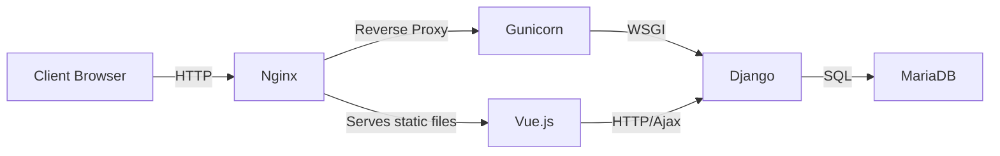

# Deployment

## Overview

Setting up the production environment can be full of surprises and jumpscares. The following steps are replicable on a Debian 11 machine with no pre-installed packages or software. Docker could possibly be a better solution for deployment.

Different from the development environment, the production environment uses the following technologies:

- [Nginx](https://www.nginx.com/): A web server that can also be used as a reverse proxy, load balancer, mail proxy and HTTP cache.
- [Gunicorn](https://gunicorn.org/): A Python WSGI HTTP Server for UNIX.

The following diagram illustrates the client-server architecture of the application.



## Deployment Steps

### 1. System

1. Install zsh, oh my zsh

2. Install python

    ```shell
    wget https://repo.anaconda.com/miniconda/Miniconda3-py311_23.5.2-0-Linux-x86_64.sh
    zsh Miniconda3-py311_23.5.2-0-Linux-x86_64.sh
    ~/miniconda3/bin/conda init zsh
    ```

3. Install the font

    ```shell
    sudo apt install zip unzip
    ```

    ```shell
    wget https://github.com/JulietaUla/Montserrat/archive/refs/tags/v7.222.zip
    unzip v7.222.zip
    sudo mkdir -p /usr/share/fonts/truetype/Montserrat
    sudo cp xxxx/fonts/ttf/* /usr/share/fonts/truetype/Montserrat/
    sudo fc-cache -fv
    ```

4. Clone the codebase

    ```shell
    cd /var/www
    git clone xxx
    ```


### 2. Backend

1. Create virtual env

    ```shell
    conda env create -f environment.yml
    pip install -r requirements.txt
    ```

2. Install mysqlclient

    ```shell
    sudo apt-get install python3-dev default-libmysqlclient-dev build-essential pkg-config
    pip install mysqlclient
    ```

3. Install weasyprint

    ```shell
    apt install libpango-1.0-0 libpangoft2-1.0-0 libjpeg-dev libopenjp2-7-dev libffi-dev
    pip install weasyprint
    ```

4. Install mariadb

    ```shell
    sudo apt update
    sudo apt install mariadb-server
    sudo mysql_secure_installation
    ```

5. Add form database and admin

    ```sql
    CREATE DATABASE betterform;
    CREATE USER 'xxxxx'@'localhost' IDENTIFIED BY 'xxxxx';
    GRANT ALL PRIVILEGES ON betterform.* TO 'xxxxx'@'localhost';
    FLUSH PRIVILEGES;
    EXIT;
    ```

6. Import database

    ```shell
    mysql -u form_admin -p betterform < db.sql
    ```

7. Generate secret key

    ```python
    # from django.core.management.utils import get_random_secret_key
    # print(get_random_secret_key())
    # Another way
    import string
    import random
    key = ''.join(random.choice(string.ascii_letters + string.digits + '_-@') for _ in range(50))
    print(key)
    ```

8. Django settings

    ```python
    # In prod.py
    DEBUG = False

    DATABASES = {
        'default': {
            'ENGINE': 'django.db.backends.mysql',
            'NAME': 'betterform',
            'USER': 'xxxxx',
            'PASSWORD': 'xxxxx',
            'HOST': 'localhost',
            'PORT': '3306',
        }
    }
    ```

    ```python
    # In base.py
    CORS_ORIGIN_WHITELIST = (
        'http://localhost:5173',
        'http://xxx.xxx.xxx.xxx',
    )

    CORS_ALLOW_HEADERS = list(default_headers) + [
        'X-CSRFToken',
    ]

    CSRF_TRUSTED_ORIGINS = [
        'http://localhost:5173',
        'http://xxx.xxx.xxx.xxx',
    ]

    # Optional
    CORS_ALLOWED_ORIGINS = [
        'http://localhost:5173',
        'http://xxx.xxx.xxx.xxx',
    ]
    ```

9. Collect static files

    ```shell
    python manage.py collectstatic
    ```

10. Add tmp dir for pdf

    ```
    - backend
        - createpdf
            - assets
                - tmp
                    - quotes
                    - invoices
    ```


### 3. Frontend

1. Install nvm

    ```shell
    curl -o- https://raw.githubusercontent.com/nvm-sh/nvm/v0.39.3/install.sh | bash
    ```

2. Install node.js

    ```shell
    nvm install node
    ```

3. Install packages

    ```shell
    npm install
    ```

4. Add .env file

    ```
    # .env.production
    VITE_APP_API_BASE_URL=http://xxx.xxx.xxx.xxx
    VITE_APP_FORM_BASE_URL=http://xxx.xxx.xxx.xxx
    ```

    ```
    # .env.development
    VITE_APP_API_BASE_URL=http://127.0.0.1:8000
    VITE_APP_FORM_BASE_URL=http://localhost:5173
    ```

5. build frontend project

    ```shell
    npm run build
    ```


### 4. Network

1. Install Nginx

    ```shell
    sudo apt install nginx
    // Start nginx
    sudo systemctl start nginx
    ```

2. Install gunicorn

    ```shell
    pip install gunicorn
    ```

3. Configure gunicorn

    Socket:

    ```shell
    sudo vi /etc/systemd/system/gunicorn.socket
    ```

    ```
    [Unit]
    Description=gunicorn socket

    [Socket]
    ListenStream=/run/gunicorn.sock

    [Install]
    WantedBy=sockets.target
    ```

    Service:

    ```shell
    sudo vi /etc/systemd/system/gunicorn.service
    ```

    ```
    [Unit]
    Description=gunicorn daemon
    Requires=gunicorn.socket
    After=network.target

    [Service]
    User=admin
    Group=www-data
    Environment="DJANGO_SETTINGS_MODULE=backend.settings.prod"
    Environment="DJANGO_SECRET_KEY='xxxxxxxxxx'"
    Environment="DJANGO_DB_USER=xxxxx"
    Environment="DJANGO_DB_PASSWORD=xxxxx"
    WorkingDirectory=/var/www/AutoForm/backend
    ExecStart=/home/admin/miniconda3/envs/django-env/bin/gunicorn \
            --access-logfile - \
            --workers 3 \
            --bind unix:/run/gunicorn.sock \
            backend.wsgi:application

    [Install]
    WantedBy=multi-user.target
    ```

    Check:

    ```shell
    sudo systemctl start gunicorn
    sudo systemctl enable gunicorn
    sudo systemctl status gunicorn.socket
    file /run/gunicorn.sock
    sudo journalctl -u gunicorn.socket
    ```

    If need to change the socket:
    ```shell
    sudo systemctl daemon-reload
    sudo systemctl restart gunicorn
    ```

4. Configure Nginx:

    ```shell
    sudo vi /etc/nginx/sites-available/betterform
    ```

    ```
    server {
        listen 80;
        server_name xxx.xxx.xxx.xxx;

        location / {
            alias /var/www/AutoForm/frontend/dist/;
            try_files $uri $uri/ /index.html;
        }

        location /static/ {
            alias /var/www/AutoForm/backend/backend/collected_static/;
        }

        location /api/ {
            include proxy_params;
            proxy_pass http://unix:/run/gunicorn.sock;
        }

        location /admin/ {
            include proxy_params;
            proxy_pass http://unix:/run/gunicorn.sock;
        }

        location /pdf/ {
            include proxy_params;
            proxy_pass http://unix:/run/gunicorn.sock;
        }

        location /monday/ {
            include proxy_params;
            proxy_pass http://unix:/run/gunicorn.sock;
        }
    }
    ```

    Enable the file

    ```shell
    sudo ln -s /etc/nginx/sites-available/betterform /etc/nginx/sites-enabled
    ```

    Restart

    ```shell
    sudo nginx -t
    sudo systemctl restart nginx
    ```

5. Firewall

    ```shell
    sudo ufw allow 'Nginx Full'
    ```


### 5. Debug

- Check the Nginx process logs: `sudo journalctl -u nginx`
- Check the Nginx access logs: `sudo less /var/log/nginx/access.log`
- Check the Nginx error logs: `sudo less /var/log/nginx/error.log`
- Check the Gunicorn application logs: `sudo journalctl -u gunicorn`
- Check the Gunicorn socket logs: `sudo journalctl -u gunicorn.socket`