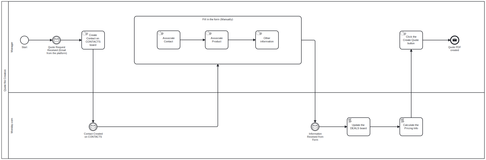
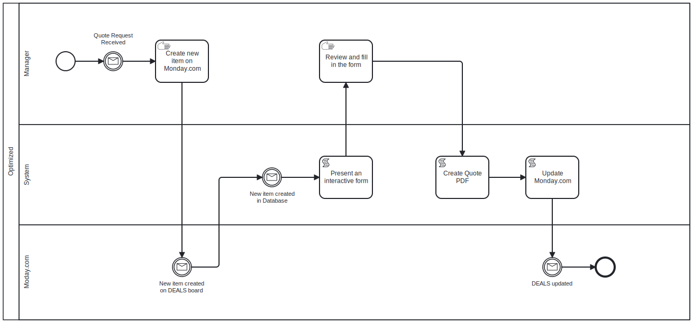

# Introduction

Welcome to the developer documentation for the Augmented Quote Management System based on monday.com!

This documentation provides detailed instructions for setting up the development environment, understanding the project architecture, and working with the codebase. It is intended for current and future developers, contributors, and any other interested individuals who are part of this project.

The Augmented Quote Management System is designed to streamline and automate the creation of quotes for our company. The system interacts with the monday.com platform, providing more robust functionalities to reduce human effort and error in the current quote creation process. 

The original process is reduntant and easy to make mistakes:

The new process is more efficient and less error-prone:

One of the key features of the system is its form system that retrieves stored information from a backend database. This automatic fetch functionality reduces the time spent on manual data entry and also minimizes errors. Moreover, the system performs the necessary calculations based on the retrieved data, enhancing the overall efficiency and accuracy of quote creation.

Our aim with this system is not only to make process management effortless but also to make it as error-free as possible. By integrating with monday.com and utilizing the power of automation, we believe we can achieve this goal.

The journey to simplify and enhance our management process starts here. Happy coding!
